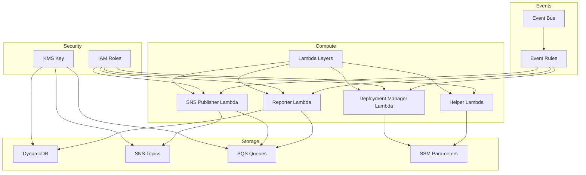
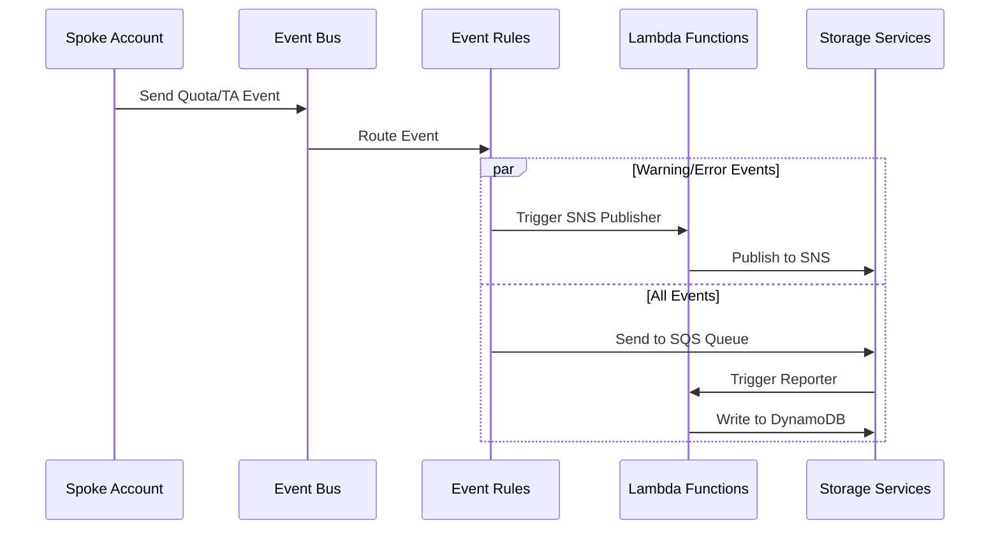
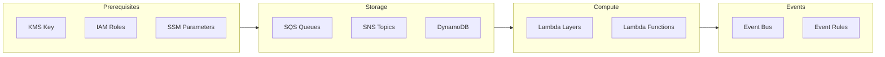
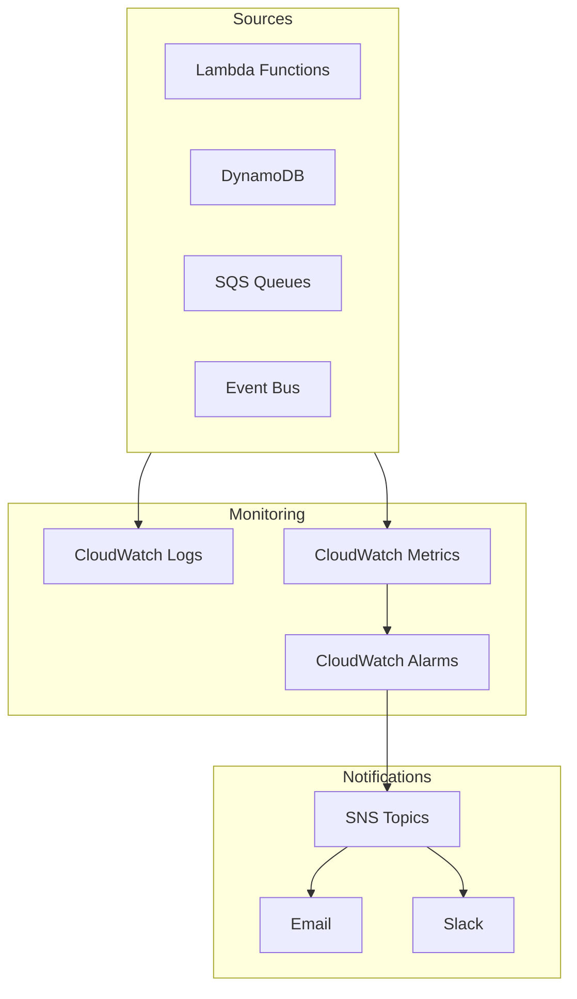
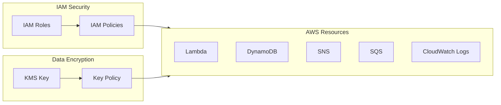

# Quota Monitor Hub Module

## Overview
Hub module là thành phần trung tâm của giải pháp Quota Monitor, chịu trách nhiệm quản lý và điều phối việc giám sát quota trên toàn bộ tổ chức AWS.

## Architecture
![Architecture Diagram]
(Cần thêm diagram mô tả kiến trúc)

## Resources Created

### 1. Event Bus (Central Event Bus)
- **Resource**: EventBridge Event Bus
- **Purpose**: Là điểm trung tâm nhận tất cả các events từ các spoke accounts
- **Dependencies**: None
- **Key Features**:
  - Nhận events từ Trusted Advisor
  - Nhận events từ Service Quotas
  - Phân phối events tới các targets thích hợp

### 2. KMS Key
- **Resource**: KMS Customer Managed Key
- **Purpose**: Mã hóa dữ liệu cho tất cả các services
- **Dependencies**: None
- **Used By**:
  - SNS Topics
  - SQS Queues
  - DynamoDB Tables
  - CloudWatch Logs

### 3. DynamoDB Tables
- **Resource**: DynamoDB Table
- **Purpose**: Lưu trữ thông tin quota và trạng thái
- **Dependencies**: KMS Key
- **Key Features**:
  - Point-in-time recovery
  - Server-side encryption
  - TTL enabled
  - Deletion protection

### 4. Lambda Functions
#### a. Helper Function
- **Purpose**: Hỗ trợ các chức năng chung
- **Dependencies**: IAM Role, Lambda Layer
- **Features**: VPC Access, CloudWatch Logs

#### b. SNS Publisher Function
- **Purpose**: Gửi notifications tới SNS
- **Dependencies**: IAM Role, SQS DLQ, Lambda Layer
- **Features**: Error handling với DLQ

#### c. Reporter Function
- **Purpose**: Tạo báo cáo định kỳ
- **Dependencies**: IAM Role, SQS DLQ, Lambda Layer
- **Features**: Scheduled execution

#### d. Deployment Manager Function
- **Purpose**: Quản lý việc deploy spoke stacks
- **Dependencies**: IAM Role, SQS DLQ, Lambda Layer
- **Features**: CloudFormation StackSet management

### 5. Lambda Layers
- **Resource**: Lambda Layer
- **Purpose**: Shared code và dependencies
- **Dependencies**: None
- **Used By**: Tất cả Lambda functions

### 6. SNS Topics
- **Resource**: SNS Topic
- **Purpose**: Gửi notifications
- **Dependencies**: KMS Key
- **Features**: Email subscriptions

### 7. SQS Queues
#### a. Dead Letter Queues
- **Purpose**: Xử lý failed messages
- **Dependencies**: KMS Key
- **Used By**: Lambda functions

#### b. Summarizer Event Queue
- **Purpose**: Queue events để summarize
- **Dependencies**: KMS Key
- **Features**: Message retention và visibility timeout

### 8. SSM Parameters
- **Resource**: SSM Parameters
- **Purpose**: Store configuration
- **Key Parameters**:
  - Slack Webhook URL
  - Target OUs/Accounts
  - Notification Configuration
  - Regions List

### 9. IAM Roles
- **Resource**: IAM Roles và Policies
- **Purpose**: Permissions cho services
- **Key Roles**:
  - Lambda Execution Roles
  - EventBridge Roles
  - CloudWatch Roles

### 10. Event Rules
- **Resource**: EventBridge Rules
- **Purpose**: Route và filter events
- **Dependencies**: Event Bus
- **Key Rules**:
  - SNS Publisher Rule
  - Summarizer Rule
  - Reporter Rule
  - Deployment Manager Rule

## Detailed Resource Relationships

### Event Bus & Rules Flow
1. Central Event Bus
   - Nhận events từ:
     * Spoke accounts thông qua organization policy
     * Trusted Advisor checks
     * Service Quotas metrics
   - Gửi events đến:
     * SNS Publisher Lambda (cho WARN/ERROR events)
     * Summarizer SQS Queue (cho tất cả events)
     * Reporter Lambda (theo schedule)

2. Event Rules
   - SNS Publisher Rule:
     * Source: Event Bus
     * Target: SNS Publisher Lambda
     * Condition: status = WARN/ERROR
   - Summarizer Rule:
     * Source: Event Bus
     * Target: Summarizer SQS Queue
     * Condition: All events
   - Reporter Rule:
     * Schedule: rate(5 minutes)
     * Target: Reporter Lambda
   - Deployment Manager Rule:
     * Source: SSM Parameter changes
     * Target: Deployment Manager Lambda

### Lambda Functions Chain
1. SNS Publisher Function:
   - Triggered by: Event Rules
   - Reads from: SSM Parameters (notification config)
   - Writes to: SNS Topic
   - Uses: Lambda Layer (utils)
   - DLQ: SNS Publisher DLQ
   - Permissions: IAM Role (sns_publisher)

2. Reporter Function:
   - Triggered by: Event Rules (scheduled)
   - Reads from: 
     * Summarizer SQS Queue
     * DynamoDB Table (quota data)
   - Writes to: DynamoDB Table (reports)
   - Uses: Lambda Layer (utils)
   - DLQ: Reporter DLQ
   - Permissions: IAM Role (reporter)

3. Deployment Manager Function:
   - Triggered by: 
     * Event Rules (parameter changes)
     * Manual invocation
   - Reads from: SSM Parameters (deployment config)
   - Manages: CloudFormation StackSets
   - Uses: Lambda Layer (utils)
   - DLQ: Deployment Manager DLQ
   - Permissions: IAM Role (deployment_manager)

4. Helper Function:
   - Called by: Other Lambda functions
   - Provides: Shared utilities
   - Uses: Lambda Layer (utils)
   - Permissions: IAM Role (helper)

### Storage & Messaging Flow
1. DynamoDB Table:
   - Written by:
     * Reporter Lambda (quota data)
     * Deployment Manager Lambda (deployment status)
   - Read by:
     * Reporter Lambda (for reports)
     * SNS Publisher Lambda (for notifications)
   - Encrypted by: KMS Key
   - Protected by: IAM Roles

2. SNS Topics:
   - Publishers:
     * SNS Publisher Lambda
   - Subscribers:
     * Email endpoints
     * Slack (via Lambda)
   - Encrypted by: KMS Key
   - Protected by: Topic Policy

3. SQS Queues:
   - Main Queues:
     * Summarizer Queue:
       - Written by: Event Rules
       - Read by: Reporter Lambda
   - Dead Letter Queues:
     * SNS Publisher DLQ
     * Reporter DLQ
     * Deployment Manager DLQ
   - All encrypted by: KMS Key
   - Protected by: Queue Policies

### Configuration & Security Flow
1. KMS Key:
   - Used by:
     * DynamoDB (table encryption)
     * SNS (message encryption)
     * SQS (message encryption)
     * CloudWatch Logs (log encryption)
   - Managed through: Key Policy
   - Accessed via: IAM Roles

2. SSM Parameters:
   - Slack Webhook:
     * Read by: SNS Publisher Lambda
   - Organizational Units:
     * Read by: Deployment Manager Lambda
   - Target Accounts:
     * Read by: Deployment Manager Lambda
   - Notification Config:
     * Read by: SNS Publisher Lambda
   - Regions List:
     * Read by: Deployment Manager Lambda

3. IAM Roles & Policies:
   - Lambda Roles:
     * sns_publisher_role → SNS, SQS, SSM
     * reporter_role → DynamoDB, SQS
     * deployment_manager_role → CloudFormation, Organizations
     * helper_role → Basic Lambda execution
   - Event Rules Roles:
     * event_bus_role → PutEvents
   - Cross-service permissions through resource policies

### Monitoring & Logging Flow
1. CloudWatch Logs:
   - Lambda Logs:
     * All Lambda functions
     * Encrypted with KMS
   - Event Bus Logs:
     * Delivery failures
     * Rule matches
   - Metric Filters:
     * Error tracking
     * Performance monitoring

2. CloudWatch Metrics:
   - Lambda Metrics:
     * Invocations
     * Errors
     * Duration
   - DynamoDB Metrics:
     * Read/Write capacity
     * Throttling
   - SQS Metrics:
     * Queue depth
     * Message age
   - Custom Metrics:
     * Quota utilization
     * Notification counts

## Deployment Order
1. KMS Key
2. IAM Roles
3. SQS Queues
4. SNS Topics
5. DynamoDB Tables
6. SSM Parameters
7. Lambda Layers
8. Lambda Functions
9. Event Bus
10. Event Rules

## Configuration
Key configuration parameters are managed through terraform variables:
- `master_prefix`: Prefix for all resources
- `regions_list`: Target regions for deployment
- `management_account_id`: AWS Management Account ID
- `vpc_config`: VPC configuration for Lambda functions
- `notification_settings`: Email và Slack settings
- `monitoring_settings`: SageMaker và Connect monitoring

## Outputs
The module exports various outputs including:
- ARNs for all created resources
- Names and IDs for resources
- Account and region information
- Helper UUID for tracking

## Notes
- Ensure proper IAM permissions before deployment
- Configure VPC settings if Lambda VPC access is needed
- Set up proper encryption keys if using custom KMS
- Review and adjust monitoring thresholds as needed

## Related Modules
- Spoke Module: Deployed in member accounts
- Modules: Shared module containing resource definitions

## Architecture Diagrams

### Resource Relationships

### Event Processing Flow

### Deployment Flow

### Monitoring Flow

### Security Flow

