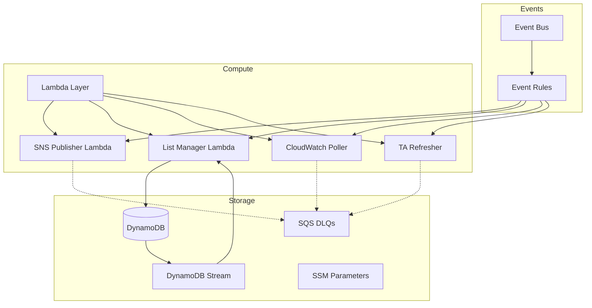
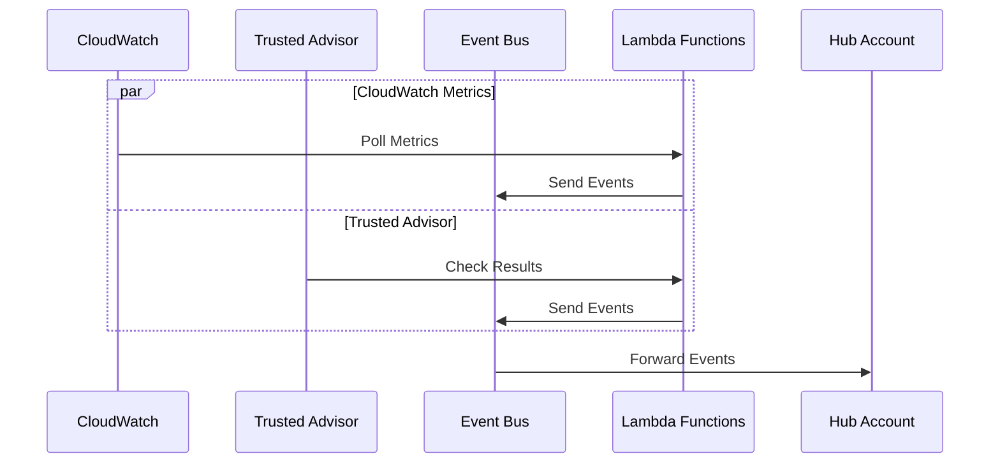
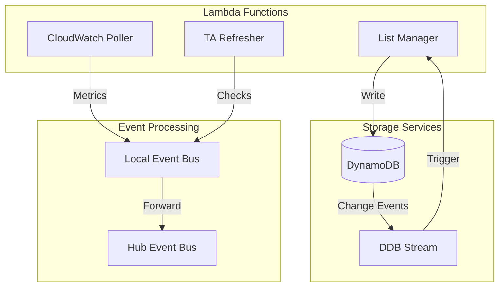
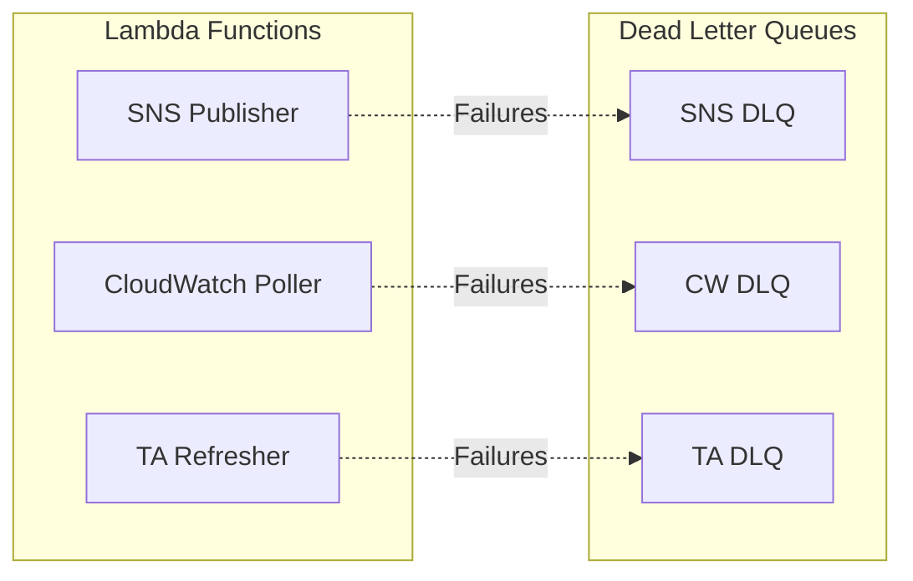

# Quota Monitor Spoke Module

## Overview
Spoke module là thành phần được triển khai trên các member accounts trong tổ chức AWS, chịu trách nhiệm thu thập và gửi các events về quota utilization và Trusted Advisor checks về hub account.

## Architecture
![Architecture Diagram]
(Cần thêm diagram mô tả kiến trúc)

## Resources Created

### 1. DynamoDB Tables
- **Resource**: DynamoDB Tables
- **Purpose**: Lưu trữ thông tin về services và quotas
- **Tables**:
  #### a. Service Table
  - **Purpose**: Lưu thông tin về AWS services
  - **Key Schema**: 
    * Hash Key: ServiceCode
  - **Features**:
    * Stream enabled
    * Point-in-time recovery
    * Server-side encryption

  #### b. Quota Table
  - **Purpose**: Lưu thông tin về service quotas
  - **Key Schema**:
    * Hash Key: ServiceCode
    * Range Key: QuotaCode
  - **Features**:
    * Point-in-time recovery
    * Server-side encryption

### 2. Event Bus
- **Resource**: EventBridge Event Bus
- **Purpose**: Route events tới hub account
- **Types**:
  #### a. SNS Spoke Bus
  - **Purpose**: Handle SNS notifications
  - **Features**: Cross-account event routing

  #### b. Quota Monitor Spoke Bus
  - **Purpose**: Handle quota và TA events
  - **Features**: Organization policy

### 3. Lambda Functions
#### a. SNS Publisher Function
- **Purpose**: Xử lý và gửi notifications
- **Dependencies**: IAM Role, SQS DLQ
- **Triggers**: Event Rules
- **Features**: Error handling với DLQ

#### b. List Manager Function
- **Purpose**: Quản lý service và quota lists
- **Dependencies**: IAM Role, DynamoDB
- **Features**: DynamoDB Stream processing

#### c. CloudWatch Poller Function
- **Purpose**: Poll CloudWatch metrics
- **Dependencies**: IAM Role, SQS DLQ
- **Features**: Scheduled execution

#### d. Trusted Advisor Refresher Function
- **Purpose**: Refresh TA checks
- **Dependencies**: IAM Role, SQS DLQ
- **Features**: Scheduled execution

### 4. Lambda Layers
- **Resource**: Lambda Layer
- **Purpose**: Shared code và dependencies
- **Layers**:
  - Utils SNS Spoke
  - Utils TA
- **Used By**: Tất cả Lambda functions

### 5. Event Rules
- **Resource**: EventBridge Rules
- **Purpose**: Route và filter events
- **Rules**:
  #### a. SNS Publisher Rule
  - **Source**: Event Bus
  - **Target**: SNS Publisher Lambda
  - **Pattern**: Warning/Error events

  #### b. List Manager Rule
  - **Schedule**: rate(30 days)
  - **Target**: List Manager Lambda

  #### c. CloudWatch Poller Rule
  - **Schedule**: rate(5 minutes)
  - **Target**: CW Poller Lambda

  #### d. TA Refresher Rule
  - **Schedule**: rate(1 hour)
  - **Target**: TA Refresher Lambda

### 6. SQS Queues
- **Resource**: SQS Queue
- **Purpose**: Dead Letter Queues
- **Queues**:
  - SNS Publisher DLQ
  - CloudWatch Poller DLQ
  - TA Refresher DLQ

### 7. SSM Parameters
- **Resource**: SSM Parameter
- **Purpose**: Configuration storage
- **Parameters**:
  - Notification Muting Configuration

## Detailed Resource Relationships

### Event Flow
1. Event Sources:
   - CloudWatch Metrics (via Poller)
   - Trusted Advisor Checks
   - Service Quotas
   - DynamoDB Streams

2. Event Processing:
   - Events → Event Bus
   - Event Rules → Lambda Functions
   - Lambda Functions → Hub Event Bus

### Data Flow
1. Service & Quota Data:
   - List Manager → DynamoDB Tables
   - DynamoDB Streams → List Manager

2. Monitoring Data:
   - CloudWatch Poller → Event Bus
   - TA Refresher → Event Bus

### Error Handling
1. Lambda Failures:
   - Failed executions → DLQ
   - Retry policies
   - Dead letter handling

## Architecture Diagrams

### Resource Relationships

### Event Processing Flow

### Data Management Flow

### Error Handling Flow

## Deployment Order
1. IAM Roles
2. DynamoDB Tables
3. SQS Queues
4. SSM Parameters
5. Lambda Layers
6. Lambda Functions
7. Event Bus
8. Event Rules

## Configuration
Key configuration parameters:
- `master_prefix`: Resource naming prefix
- `vpc_config`: VPC settings for Lambda
- `sagemaker_monitoring`: Enable/disable SageMaker monitoring
- `connect_monitoring`: Enable/disable Connect monitoring
- `aws_services`: List of services to monitor

## Outputs
The module exports:
- DynamoDB table ARNs và streams
- Event bus ARNs
- Lambda function ARNs
- SQS queue ARNs
- SSM parameter ARNs

## Notes
- Ensure proper cross-account permissions
- Configure monitoring thresholds appropriately
- Review DynamoDB capacity settings
- Monitor Lambda concurrency limits

## Related Modules
- Hub Module: Central event processing
- Modules: Shared resource definitions