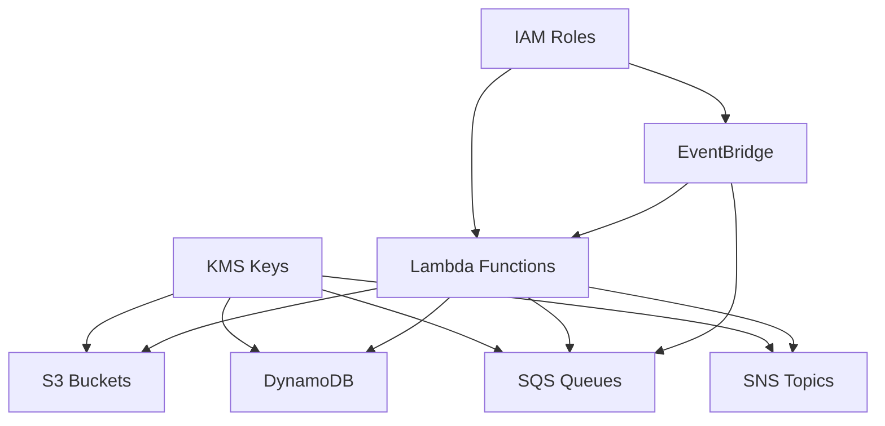

# Quota Monitor Shared Modules

## Overview
Shared modules chứa các định nghĩa resource được sử dụng chung bởi cả hub và spoke modules. Các modules này cung cấp một cách nhất quán để tạo và quản lý các AWS resources.

## Module Structure
```
modules/
├── data.tf                      # Data sources
├── dynamodb.tf                  # DynamoDB table definitions
├── events.tf                    # EventBridge resources
├── iam.tf                       # IAM roles and policies
├── kms.tf                       # KMS key management
├── lambda_event_source_mapping.tf # Lambda event sources
├── lambda_layer.tf              # Lambda layers
├── lambda_permission.tf         # Lambda permissions
├── lambda.tf                    # Lambda functions
├── locals.tf                    # Local variables
├── logs.tf                      # CloudWatch logs
├── outputs.tf                   # Module outputs
├── s3.tf                       # S3 buckets and objects
├── sns.tf                       # SNS topics
├── sqs.tf                       # SQS queues
├── ssm-parameter.tf            # SSM parameters
├── variables.tf                # Input variables
└── versions.tf                 # Provider versions
```

## Resources Provided

### 1. DynamoDB Tables
- Configurable attributes
- Stream settings
- Encryption options
- Backup settings
- TTL configuration

### 2. EventBridge Resources
- Event buses
- Event rules
- Event targets
- Schedule groups

### 3. IAM Resources
- Role creation
- Policy attachment
- Cross-account permissions
- Service-linked roles

### 4. KMS Resources
- Key creation
- Key policies
- Aliases
- Key rotation settings

### 5. Lambda Resources
- Function configuration
- Environment variables
- VPC settings
- Logging configuration
- Permissions
- Layers
- Event source mappings

### 6. SNS Resources
- Topic creation
- Subscriptions
- Access policies
- Encryption settings

### 7. SQS Resources
- Queue creation
- Dead letter queues
- Access policies
- Encryption settings

### 8. SSM Parameters
- Parameter creation
- Secure strings
- Parameter policies
- Tiering options

### 9. S3 Resources
- Bucket creation
- Object management
- Lifecycle rules
- Versioning
- Server-side encryption
- Object upload with source/content
- Provider tags override for objects

## Usage

### Basic Module Usage
```hcl
module "aws_resources" {
  source = "../modules"
  
  create        = true
  master_prefix = var.master_prefix
  
  # Resource specific configurations
  create_dynamodb = true
  create_lambda   = true
  create_sns      = true
  create_s3       = true
  # etc...
}
```

### Resource Creation Controls
Mỗi loại resource có một biến điều khiển riêng:
- `create`: Master switch cho toàn bộ module
- `create_dynamodb`: Control DynamoDB creation
- `create_lambda`: Control Lambda creation
- `create_sns`: Control SNS creation
- `create_sqs`: Control SQS creation
- `create_event`: Control EventBridge creation
- `create_role`: Control IAM role creation
- `create_kms`: Control KMS creation
- `create_ssm_parameter`: Control SSM parameter creation
- `create_s3`: Control S3 creation

## Input Variables

### Common Variables
- `master_prefix`: Prefix cho tất cả resources
- `tags`: Common tags cho tất cả resources
- `additional_tags`: Additional tags cho resources

### Resource Specific Variables
Mỗi resource type có các biến cấu hình riêng:
- `dynamodb_tables`: DynamoDB table configurations
- `lambda_functions`: Lambda function configurations
- `sns_topics`: SNS topic configurations
- `sqs_queue`: SQS queue configurations
- `event_buses`: EventBridge bus configurations
- `iam_roles`: IAM role configurations
- `s3_buckets`: S3 bucket configurations
- `s3_objects`: S3 object configurations
- etc...

## Outputs
Module exports các outputs cho mỗi resource type:
- ARNs
- Names/IDs
- URLs (cho SQS)
- Stream ARNs (cho DynamoDB)
- Domain names (cho S3)

## Dependencies


## Resource Naming
- Tất cả resources được prefix với `master_prefix`
- Maximum length restrictions được handle tự động
- Consistent naming convention across all resources

## Security Features
- KMS encryption by default
- IAM least privilege
- VPC support for Lambda
- Resource policies
- Cross-account access controls
- S3 bucket encryption và versioning
- S3 lifecycle management

## Best Practices
1. Luôn set `create` flags phù hợp
2. Sử dụng KMS encryption khi có thể
3. Configure proper IAM permissions
4. Enable logging và monitoring
5. Use tags for resource management
6. Configure S3 lifecycle rules
7. Enable versioning cho critical buckets

## Notes
- Test all configurations trước khi apply
- Review IAM permissions carefully
- Monitor CloudWatch logs
- Backup sensitive data
- Keep KMS key policies up to date
- Check S3 bucket policies và public access settings